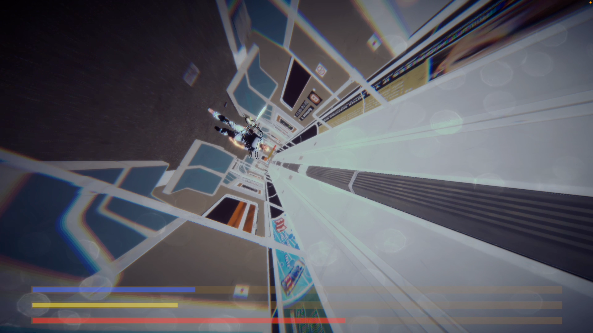

>  Developed solo under tight time constraints as part of an academic challenge.
### Code Highlights

##### OOP principles

- Follows SOLID principles for clean, maintainable architecture

##### Design Patterns:

- Singleton
- Observer
- Decorator
- Object Pooling
  
##### Scalability

The code is designed to be highly modular and easily extensible, allowing:
- Simple integration of new powerups
- Addition of new boss phases, attack logic, or AI states
- Expansion of audio systems, UI elements, and gameplay features with minimal changes

---
# 🦟 EL MOSQUITO

_Advanced Unity Course Project · Hebrew University × Bezalel (2025)_

- All of my code is located under "Assets/_MSQT"
---

---

## Game Description

Your mission: **bite down** a dude on a train before he slaps you dead.  
This one-level boss fight combines reactive AI, procedural animation, and decorator-driven upgrades in a fast-paced, precision-driven experience.

---

## Videos

- [Gameplay](https://youtu.be/Kp4RKf0lAo8)  
- [Technical Overview](https://drive.google.com/file/d/1Un0tSdOGo83M4Yo-Xscyc99jX-QyVUVX/view?usp=sharing)

---

## ▶ Play the Game

[ItchIO page](https://tamirmoshko.itch.io/el-mosquito)

---

## Boss Design: 2 Phases

1. **Phase 1 – The Seated Slapper**  
   - He sits. You bite. He slaps.  
   - Procedural slap animations.  
   - Your job: sneak in, bite exposed skin, and dodge the hands.

2. **Phase 2 – The Pursuer**  
   - At 33% HP, he **gets up and starts chasing you**.  
   - Slaps remain procedural, but now he moves with intent.  
   - The pressure ramps up - tighter spacing, less recovery time, and constant pursuit.

---

## Controls
(the game is made for a gamepad)

| Action       | Input                |
|--------------|----------------------|
| Move         | Right Stick          |
| Boost        | Double Click L1      |

---

## Notable Systems

### Inverse Kinematic Slap System  
- Boss arms use **Cinemachine path + TwoBoneIK**  
- Attacks trigger based on player distance and randomized reaction timing

### Decorator-Based Mosquito Powerups
- Speed, Maneuverability, and Damage buffs stack via the Decorator pattern  
- Power-up stack is reversible – buffs are lost when hit

---

# Credits

- **Developer:** Tamir Moshkovitz  
- **Institution:** Hebrew University & Bezalel Academy  
- **Course:** Advanced Unity (2025 Minor in Game Dev & Design)
- **Guidance:** Shahar Bar

---
### Packages

- All imported packages are from the Unity Asset Store

---
### Music

#### Opening Scene:

- “Mosquito​” by KAJ

#### In-Game:

- “Danger Zone” by Kenny Loggins

#### Ending:

- “Take My Breath Away” by Berlin

- “Memories”  by Harold Faltermeyer​

---

This project was created as part of the Advanced Unity course

at the Hebrew University × Bezalel Academy (2025).

It is a non-commercial, student project made purely for pedagogical purposes.

All copyrighted music is used under the assumption of fair educational use,

and no profit or monetization is intended.

